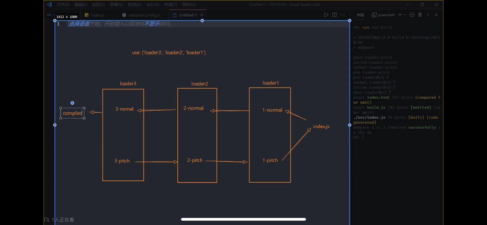
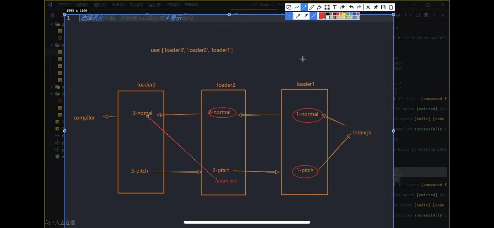

### 前置知识
在Node运行环境下
- process.cwd()：返回Node进程的当前工作目录
- process.argv：返回Node进程的命令行参数（shell语句）
- __dirname：返回当前模块的目录名
- __filename：返回当前模块的文件名

babel各个模块的作用
- parser：将源码转换成ast
- traverse：遍历ast
- types：用来修改ast
- generator：将ast转换成源码


### webpack是怎么处理每个模块的导入导出的
- 建立一个对象存放所有依赖的文件内容，key是文件路径，value是一个函数，函数主体是文件内容
- 建立require函数，用来处理每个模块的导入导出。require函数接收一个参数，就是模块的路径，然后根据路径去对象中找到对应的函数，传入module，执行函数，改变module.exports的值。最后require函数返回module.exports的值
- 依赖的模块也要经过上面两个步骤，所以要递归调用require函数


```js

(() => {
  const modules = {
    './src/constant/name.js': (module, exports, require) => {
      const name1 = '徐瑞熙11111';
      module.exports = {
        name1: name1
      };
    }, './src/constant/constant.js': (module, exports, require) => {
      const {
        name1
      } = require("./src/constant/name.js");
      const name = '徐瑞熙';
      module.exports = {
        name: name,
        name1: name1
      };
    }
  }
  const cache = {};
  function require(moduleId) {
    if (cache[moduleId]) {
      return cache[moduleId].exports;
    }
    const module = cache[moduleId] = {
      exports: {}
    };
    modules[moduleId](module, module.exports, require);
    return module.exports;
  }
  const {
    name,
    name1
  } = require("./src/constant/constant.js");
  console.log(name);
  console.log(name1);
})()

```


---

### plugin和loader的区别
- loader：用来处理匹配到的模块（处理模块）。
- plugin：在webpack整个打包过程中，会广播出许多事件，plugin可以监听这些事件，在合适的时机通过webpack提供的API改变输出结果（改变打包结果）。


### webpack插件相关知识
- tapable：webpack的插件系统，webpack的插件都是基于tapable实现的。在插件的apply方法中，通过compiler.hooks.xxx.tap注册插件
- hooks的生命周期
  - run：在run方法开始时触发
  - done：在run方法结束时触发
  - emit：在生成资源到 output 目录之前触发
  - 。。。。。。
### webpack loader相关知识
- loader执行顺序：从数组的最后一个元素开始执行，然后依次向前执行。
  - pitch方法是在loader执行之前执行的，pitch方法的执行顺序是从数组的第一个元素开始执行，然后依次向后执行。

  - 如果pitch方法返回了一个值，那么这个值会被传递给loader的第一个参数，然后loader的第一个参数就不是source了，而是pitch方法返回的值。而且后面的loader就不会执行了。
  ```js
  function logger(scorce) {
    return scorce + 'var logger = function() { console.log("logger1"); };';
  }
  logger.pitch = function() {
    return 'pitch';
  }
  ```
  

- 在loader里面，this指向的是loaderContext，loaderContext是一个loader的实例，它有很多属性和方法，比如this.query，this.async()等等。
  - this.query：获取loader的options
  - this.async()：让loader变成异步的
  - this.emitFile()：发射文件
  - 。。。。。。


- 通过使用this.async()方法，可以让loader变成异步的
```js
function logger(scorce) {
  const callback = this.async();
  setTimeout(() => {
    // null的意思是没有错误，第一个参数是错误信息
    callback(null, scorce + 'var logger = function() { console.log("logger1"); };');
  }, 1000);
}
```

- this.emitFile()：发射文件
```js
function logger(scorce) {
  // 写入文件
  this.emitFile('dist/1.txt', 'hello world');
  return scorce + 'var logger = function() { console.log("logger1"); };';
}
```

- 当我们需要使用文件的原始二进制内容时，需要设置loader的raw属性为true
```js
function imgLoader(source){
  this.emitFile('img.png', source)
  return `module.exports = "img.png"`;
}
// 设置为原始二进制
imgLoader.raw = true;

```

---


## 开始
#### 调试文件
./webpackDebugger.js

```js
const webpack = require('./webpack');
const options = require('./webpack.config.js');
const compiler = webpack(options);
compiler.run((err, stats) => {
  // console.log('err', err);
  // console.log('stats', stats);
});
```
我们在命令行运行这个文件，可以看到打包的结果
```bash
node ./webpackDebugger.js --mode=development
```


### webpack打包流程
- 初始化参数：从配置文件和Shell语句中读取与合并参数，得出最终的参数
./webpack/index.js
```js
function webpack(options) {
  // 1、初始化参数,从shell传入和webpack.config.js文件中配置，合并参数，得出最终的参数
  const argv = process.argv.slice(2);
  const shellOptions = argv.reduce((memo, current) => {
    const [key, value] = current.split('=');
    memo[key.slice(2)] = value;
    return memo;
  }, {});
  const finallOptions = { ...options, ...shellOptions };
  return compiler;
}
```

- 开始编译：用上一步得到的参数初始化Compiler对象，加载所有配置的插件，执行对象的run方法开始执行编译
./webpack/index.js
```js
const Compiler = require('./Compiler');
function webpack(options) {
  ...
  // 2、根据参数初始化Compiler对象
  const compiler = new Compiler(finallOptions);
  // 3、加载所有配置的插件，执行对象的run方法
  finallOptions.plugins.forEach(plugin => {
    plugin.apply(compiler);
  });
  return compiler;
}
```


- Compiler对象：  
它也提供了run和compile两个方法，以及tapable事件对象。run方法包含了onComplie函数，当编译完成后会执行onComplie函数，完成文件的写入和监听。compile触发Compilation对象的build方法，开始编译。  
run() => compile() => onComplie()
./webpack/Compiler.js

```js
const { SyncHook } = require('tapable');
const Compilation = require('./Compilation');
const path = require('path');
const fs = require('fs');
class Compiler {
  constructor(options) {
    this.options = options;
    this.hooks = {
      run: new SyncHook(['compilation']),
      done: new SyncHook(['stats']),
    };
  }
  // 4、执行run方法，开始编译
  run(callback) {
    // 执行run钩子函数
    this.hooks.run.call('compilation');
    const onCompiled = (err, stats, fileDependencies) => {
      // 10.根据打包后的代码生成文件
      for (let filename in stats.assets) {
        console.log(filename);
        const content = stats.assets[filename];
        const outputPath = path.join(this.options.output.path, filename);
        fs.writeFileSync(outputPath, content, 'utf8');
      }

      fileDependencies.forEach(fileDependency => {
        // 监听文件的变化
        fs.watch(fileDependency, () => {
          this.compile(onCompiled);
        });
      });

    }
    this.compile(onCompiled);
    this.hooks.done.call('stats');
  }
  compile(onCompiled) {
    // 以后每开始一次编译，就会创建一个compilation对象
    const compilation = new Compilation(this.options);
    compilation.build(onCompiled);
  }
}

```

- Compilation对象：  
Compilation对象是Compiler对象的子对象，它负责模块的构建。当执行build方法时，会从entry出发，针对每个模块串行调用所有配置的Loader对模块进行转换，再找出该模块依赖的模块，再递归本步骤，直到所有入口依赖的模块都经过了本步骤的处理，然后把所有模块组合成一个个Chunk，再把每个Chunk转换成一个单独的文件加入到输出列表，这是整个编译过程的最后一步，最后输出所有的文件到文件系统  
./webpack/Compilation.js

```js
// 使用posix模块来处理路径，保证路径的统一性(/)
const path = require('path').posix;
const fs = require('fs');
// babel的parser用来将源码转换成ast
const parser = require('@babel/parser');
// traverse用来遍历ast
const traverse = require('@babel/traverse').default;
// generator用来将ast转换成源码
const generator = require('@babel/generator').default;
const types = require('@babel/types');


// toUnix方法用来将路径中的\替换成/
const toUnix = path => path.replace(/\\/g, '/');
// 当前的工作目录
const baseDir = toUnix(process.cwd());

class Compilation {
  constructor(options) {
    // webpack的配置对象
    this.options = options;
    // 存放所有的依赖文件
    this.fileDependencies = [];
    // 存放所有的模块的依赖文件
    this.modules = [];
    // 存放所有的代码块
    this.chunks = [];
    // 存放打包后的chunk和模块的映射关系
    this.assets = {};
  }
  build(onCompiled){
    // 5、根据配置中的entry找到所有入口文件
    let entry = {};
    if (typeof this.options.entry === 'string') {
      entry.main = this.options.entry;
    } else if (typeof this.options.entry === 'object') {
      entry = this.options.entry;
    }

    for (let entryName in entry) {
      // 入口文件的绝对路径
      const entryPath = path.join(baseDir, entry[entryName]);
      this.fileDependencies.push(entryPath);
      // 获取入口文件的模块

      let entryModule = this.buildModule(entryName, entryPath);
      // 8.根据入口文件和依赖文件的关系，组装成一个包含多个模块的chunk
      let chunk = {
        // 代码块名称是入口文件的名称
        name: entryName,
        // 入口模块
        entryModule,
        // 入口模块的依赖模块
        modules: this.modules.filter(module => module.names.includes(entryName)),
      }

      this.chunks.push(chunk);
      // 9、根据chunk生成打包后的代码
      let fileName = this.options.output.filename.replace('[name]', entryName);
      this.assets[fileName] = getSource(chunk);
    }
    // 收集完所有的依赖文件后，执行回调函数，让fs.watch监听文件的变化
    onCompiled(null, {
      // 打包后的代码
      assets: this.assets,
      // 打包后的chunk和模块的映射关系
      chunks: this.chunks,
      // 所有的依赖文件
      modules: this.modules,
    }, this.fileDependencies);
  }
  buildModule(name, modulePath) {
    // 6、根据入口文件路径，读取文件内容。调用所有配置的loader对文件内容进行转换
    let sourceCode = fs.readFileSync(modulePath, 'utf8');
    // 获取匹配该文件的loader
    const rules = this.options.module.rules;
    const matchedRules = rules.map(rule => {
      if (rule.test.test(modulePath)) {
        return rule.use;
      }
    });
    // 将匹配到的loader进行合并，然后调用loader对文件内容进行转换
    const loaders = matchedRules.flat(Infinity);
    sourceCode = loaders.reduceRight((sourceCode, loader) => {
      return require(loader).call(this, sourceCode);
    }, sourceCode);

    // 7、找出文件中的依赖模块，递归调用buildModule方法，对依赖模块进行处理
    // moduleId是当前模块的相对于根目录的路径
    let moduleId = './' + path.relative(baseDir, modulePath);

    // 创建当前的模块对象，用来存储当前模块的信息。包括模块的id、模块的名称、模块的依赖
    let module = {
      id: moduleId,
      names: [name],
      dependencies: [],
    }

    const ast = parser.parse(sourceCode, { sourceType: 'module' });
    traverse(ast, {
      CallExpression: ({ node }) => {
        if (node.callee.name === 'require') {
          // 依赖的文件路径 ./constant
          const depModuleName = node.arguments[0].value;
          // 当前模块的目录（绝对路径） C:/Users/xuruixi/Desktop/npm包发布/xrx-webpack/src
          const dirname = path.dirname(modulePath);
          // 依赖的文件的绝对路径
          let depModulePath = path.join(dirname, depModuleName);
          // 获取当前支持的扩展名
          const extensions = this.options.resolve.extensions;
          // 尝试添加扩展名，如果文件存在，则返回文件的绝对路径
          depModulePath = tryExtensions(depModulePath, extensions);
          // 把依赖的文件路径添加到依赖列表中，当文件发生变化时，重新编译
          this.fileDependencies.push(depModulePath);
          // 找到依赖模块的id
          const depModuleId = './' + path.relative(baseDir, depModulePath);
          // 修改ast中的require函数的参数，换成依赖模块的id
          node.arguments = [types.stringLiteral(depModuleId)];
          module.dependencies.push({ depModuleId, depModulePath });
        }
      }
    });
    // 使用generator将ast转换成源码
    const { code } = generator(ast);
    module._source = code;
    // 递归遍历依赖模块
    module.dependencies.forEach(({ depModuleId, depModulePath }) => {
      let buildModule = this.modules.find(module => module.id === depModuleId);
      if (!buildModule) {
        // depModuleId
        let depModule = this.buildModule(name, depModulePath);
        this.modules.push(depModule);
      } else {
        buildModule.names.push(name);
      }
    });
    return module;
  }
}

function tryExtensions(modulePath, extensions) {
  if (fs.existsSync(modulePath)) {
    return modulePath;
  }
  for (let i = 0; i < extensions.length; i++) {
    const filePath = modulePath + extensions[i];
    if (filePath) {
      return filePath;
    }
  }
  throw new Error(`${modulePath} not found`);
}


function getSource(chunk) {
  return `
  (() => {
    const modules = {
      ${chunk.modules.map(module => {
    return `'${module.id}': (module, exports, require) => {
        ${module._source}
      }`
  }).join(',')}
}
    const cache = {};
    function require(moduleId) {
      if (cache[moduleId]) {
        return cache[moduleId].exports;
      }
      const module = cache[moduleId] = {
        exports: {}
      };
      modules[moduleId](module, module.exports, require);
      return module.exports;
    }
    ${chunk.entryModule._source}
  })()
  `
}
```